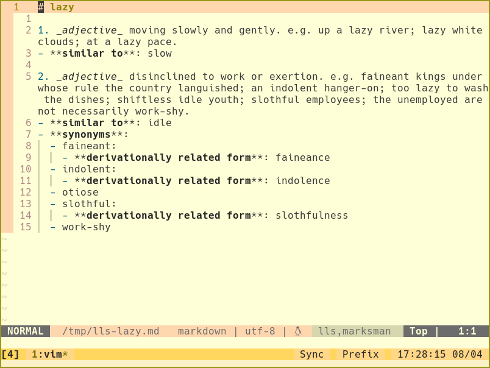

# Wordnet language server

A tool to explore language as you write, where you write.

It currently supports English, using the [WordNet](https://wordnet.princeton.edu/) database.



## Actions

- `hover` shows meaning of the word
- `gotoDefinition` of a word for all info about it
    - also available through code actions to avoid conflicts
- completion for words

## Installation

### Cargo

Currently, the main way to install wordnet-ls is by cloning the repo and running

```sh
cargo install --force wordnet-ls
```

This adds the binary `wordnet-ls` to the rust bin location.

### Nix

You can also get it on nix, using the flake in this repo:

```sh
nix shell github:jeffa5/wordnet-ls
```

## Configuration

You'll need to download a copy of [wordnet](https://wordnet.princeton.edu/download/current-version).
The tested version is 3.1.

To configure the location of the wordnet dictionary set the `initializationOptions` as:

```json
{
  "wordnet": "<location>"
}
```

Home dir (`~`) should get expanded if needed.

Capabilities are all enabled by default, but can be disabled in the `initializationOptions` (e.g. to prevent conflicting handling of `hover` or `gotoDefinition`):

```json
{
  "wordnet": "<location>",
  "enable_completion": false,
  "enable_hover": false,
  "enable_code_actions": false,
  "enable_goto_definition": false
}
```

### Neovim

For debugging and quickly adding it to neovim you can use the provided `vim.lua` file, provided you have `nvim-lspconfig`.
Just make sure to run `cargo build` and enter `nvim` from the root of this repo.

```sh
nvim test.txt
# then :LspStop
# then :luafile vim.lua
# then :LspStart
# Write some words and hit K to hover one
```

It by default is set up for the `text` and `markdown` filetypes.

## WordNet

For more information about the WordNet database see [here](https://wordnet.princeton.edu/).
